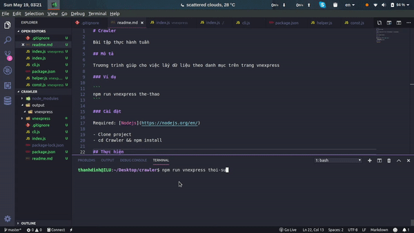

# Crawler

Bài tập thực hành tuần 



## Mô tả

Trương trình giúp cho việc lấy dữ liệu theo danh mục trên trang vnexpress

### Ví dụ

```
npm run vnexpress <category> <pages>

Example: npm run vnexpress the-thao 3
```

Options:
- category: thể loại tin tức cần crawl.
- pages: số trang cần crawl.

### Cài đặt

Required: [Nodejs](https://nodejs.org/en/)

- Clone project
- cd Crawler && npm install

## Thực hiện

**Thanh Dinh** 

